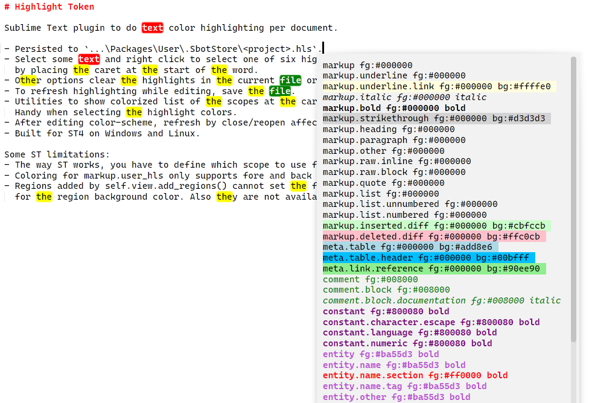

# Highlight Token

Sublime Text plugin to do text color highlighting per document.
Loosely based on the old [StyleToken](https://packagecontrol.io/packages/StyleToken).

Built for ST4 on Windows. Linux and OSX should be ok but are minimally tested - PRs welcome.

## Features

- Persisted per project to `...\Packages\User\HighlightToken\HighlightToken.store`.
- Select some text and right click to select one of six highlight colors. Select whole word
  by placing the caret at the start of the word.
- Other options clear the highlights in the current file or the whole project.
- To refresh highlighting while editing, save the file.
- Utilities to show colorized list of the scopes at the caret, or all scopes in the view.
  Handy when selecting the highlight colors.
- After editing `your.sublime-color-scheme`, refresh by close/reopen affected views. May be improved in the future.





## Commands and Menus

| Command                    | Description                      | Args                                  |
| :--------                  | :-------                         | :--------                             |
| sbot_highlight_text        | Highlight text                   | hl_index: scope markup.user_hl1 - 6   |
| sbot_clear_highlights      | Remove all highlights in file    |                                       |
| sbot_clear_all_highlights  | Remove all highlights in project |                                       |
| sbot_scope_info            | Show scopes at caret in color    |                                       |
| sbot_all_scopes            | Show all scopes in view in color |                                       |


There is no default `Context.sublime-menu` file in this plugin.
Add the commands you like to your own `User\Context.sublime-menu` file. Typical entries are:
``` json
{ "caption": "HL 1", "command": "sbot_highlight_text", "args" : {"hl_index" : "0"} },
{ "caption": "HL 2", "command": "sbot_highlight_text", "args" : {"hl_index" : "1"} },
{ "caption": "Highlight",
    "children":
    [
        { "caption": "HL 3", "command": "sbot_highlight_text", "args" : {"hl_index" : "2"} },
        { "caption": "HL 4", "command": "sbot_highlight_text", "args" : {"hl_index" : "3"} },
        { "caption": "HL 5", "command": "sbot_highlight_text", "args" : {"hl_index" : "4"} },
        { "caption": "HL 6", "command": "sbot_highlight_text", "args" : {"hl_index" : "5"} },
        { "caption": "-" },
        { "caption": "Scope Info", "command": "sbot_scope_info" },
        { "caption": "All Scopes", "command": "sbot_all_scopes" },
        { "caption": "Clear All Highlights in Project", "command": "sbot_clear_all_highlights" },
    ]
},
{ "caption": "Clear Highlights in File", "command": "sbot_clear_highlights" },
```


## Settings
| Setting            | Description                              | Options                    |
| :--------          | :-------                                 | :------                    |
| scopes_to_show     | Extra scopes to show besides default.    |                            |


## Colors
New scopes have been added to support this application. Adjust these to taste and add
to your `Packages\User\your.sublime-color-scheme` file. Note that these are also used by other
members of the sbot family.

```json
{ "scope": "markup.user_hl1", "background": "red", "foreground": "white" },
{ "scope": "markup.user_hl2", "background": "green", "foreground": "white" },
{ "scope": "markup.user_hl3", "background": "blue", "foreground": "white" },
{ "scope": "markup.user_hl4", "background": "yellow", "foreground": "black" },
{ "scope": "markup.user_hl5", "background": "lime", "foreground": "black" },
{ "scope": "markup.user_hl6", "background": "cyan", "foreground": "black" },
```

## Notes

- Some ST quirks:
  - The way ST works, you have to define which scope to use for each of the different highlights.
  - Coloring for `markup.user_hls` only supports fore and back colors, unfortunately not font_style.
  - Regions added by `self.view.add_regions()`` cannot set the foreground color. The scope color is used
    for the region background color. Also they are not available via `extract_scope()``.

- `sbot_common.py` contains miscellaneous common components primarily for internal use by the sbot family.
  This includes a very simple logger primarily for user-facing information, syntax errors and the like.
  Log file is in `$APPDATA\Sublime Text\Packages\User\HighlightToken\HighlightToken.log`.
